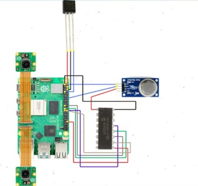

# 🚗 Caretaker – Automated Car Window Override & Dashcam System for Passenger Safety

**A real-time Raspberry Pi-based emergency safety system that prevents heatstroke and suffocation during vehicle entrapments by combining facial/emotion detection, environmental sensing, and automatic window control.**

---

## 📌 Table of Contents
- [🧠 About the Project](#-about-the-project)
- [💡 Project Motivation](#-project-motivation)
- [🛠️ System Architecture](#️-system-architecture)
- [✨ Features](#-features)
- [⚙️ Tech Stack](#️-tech-stack)
- [🔩 Hardware Components](#-hardware-components)
- [🧪 Setup Instructions](#-setup-instructions)
- [▶️ Usage](#️-usage)
- [📊 Results](#-results)
- [🚀 Future Work](#-future-work)
- [👥 Contributors](#-contributors)

---

## 🧠 About the Project

**Caretaker** is a Raspberry Pi 5-based system that automatically overrides car windows and records external events to prevent fatalities in car entrapment scenarios. The system:
- Detects human presence and emotional state using onboard ML models.
- Monitors CO₂ and temperature in real-time.
- Triggers window-opening mechanisms during emergencies.
- Alerts the owner and securely stores dashcam footage on a remote NAS.

---

## 💡 Project Motivation

Numerous fatalities have been reported due to car entrapment caused by door malfunctions or accidents. Incidents involving children, elderly, and pets highlight the need for an **automated, intelligent, and locally responsive system**.

---

## 🛠️ System Architecture

The Caretaker system is built on a modular architecture that separates data collection, processing, and actuation.

- Sensors (CO₂ and temperature) feed real-time data to Raspberry Pi 5.
- The internal camera captures facial features and emotional states.
- A window override module is triggered based on safety conditions.
- An external dashcam continuously records and syncs with a NAS using Tailscale VPN.

### 📷 Hardware Connections Overview

Below is the hardware connection diagram showing how all components interface with the Raspberry Pi:



---

## ✨ Features

- Real-time **face and emotion detection** (YOLOv5 + CNN).
- Automated **window override** mechanism.
- Continuous monitoring of **temperature** and **CO₂**.
- External **dashcam footage recording** with secure NAS sync.
- **Offline-first** processing with local decision-making.
- Secure **video storage** with AES-256 encryption via TrueNAS.

---

## ⚙️ Tech Stack

- Raspberry Pi 5 (Python)
- YOLOv5 (PyTorch-based)
- CNN for Emotion Recognition
- DHT22 (Temperature sensor)
- MQ135 (CO₂ sensor)
- Libcamera for video
- Tailscale for secure NAS connection
- TrueNAS SCALE for storage
- SMB + rsync + systemd for file sync

---

## 🔩 Hardware Components

- Raspberry Pi 5
- Raspberry Pi Camera Module 3 (Wide)
- DHT22 Temperature Sensor
- MQ135 CO₂ Sensor
- Power Window Motor Interface
- NAS with TrueNAS SCALE
- Internet connection (for NAS sync only)

---
## 🧪 Setup Instructions

Follow these steps to set up the Caretaker system on your Raspberry Pi 5 and NAS environment:

### 1️⃣ Raspberry Pi Setup

1. **Update your system packages:**
   ```bash
   sudo apt update && sudo apt upgrade -y
   ```

2. **Install required dependencies:**
   ```bash
   sudo apt install -y python3-pip libcamera-dev rsync tailscale
   pip3 install torch torchvision opencv-python dlib
   ```

3. **Enable interfaces:**
   - Open Raspberry Pi Configuration (`sudo raspi-config`)
   - Enable:  
     - Camera Interface  
     - I2C Interface (if required by sensors)  
     - SPI Interface (optional, if used for window motor)

---

### 2️⃣ Clone the Repository

```bash
git clone https://github.com/yourusername/Caretaker.git
cd Caretaker
```

Replace `yourusername` with your GitHub username.

---

### 3️⃣ Setup Crontab for Auto Dashcam Start

```bash
crontab -e
```

Add the following line to start the dashcam recording on reboot:
```bash
@reboot python3 /home/pi/Caretaker/src/start_dashcam.py &
```

---

### 4️⃣ Setup Systemd Service for NAS Sync

Create a systemd service file:

```bash
sudo nano /etc/systemd/system/caretaker-sync.service
```

Paste this:
```ini
[Unit]
Description=Caretaker Video Sync Service
After=network.target

[Service]
ExecStart=/usr/bin/python3 /home/pi/Caretaker/src/sync_to_nas.py
Restart=always
User=pi

[Install]
WantedBy=multi-user.target
```

Enable and start it:
```bash
sudo systemctl enable caretaker-sync.service
sudo systemctl start caretaker-sync.service
```

---

### 5️⃣ NAS Setup with TrueNAS SCALE

1. Install [TrueNAS SCALE](https://www.truenas.com/download-truenas-scale/) on your storage server.
2. Create two datasets:
   - `recordings` – for dashcam footage
   - `general` – for config/logs
3. Enable **SMB share** for `/recordings`.
4. Set appropriate permissions.
5. Connect Raspberry Pi via **Tailscale**:
   ```bash
   tailscale up
   ```

---

### 6️⃣ Setup rsync for NAS Sync

Add this to your script (`sync_to_nas.py`):

```python
import os
os.system("ping -c 1 google.com > /dev/null 2>&1 && rsync -av --remove-source-files /home/pi/recordings/ /mnt/nas/recordings/")
```

Ensure `/mnt/nas/recordings/` is mounted (via SMB or CIFS in `/etc/fstab`).

---

✅ Your system should now:
- Record external dashcam footage at boot
- Monitor passengers and environment
- Sync footage to NAS every 5 minutes when internet is available

## ▶️ Usage

Once the system is fully set up and powered on:

1. **Startup Behavior:**
   - The Raspberry Pi automatically starts the internal and external camera systems.
   - The dashcam begins recording as soon as the Pi boots (via `crontab`).
   - A sync service runs every 5 minutes to check for an internet connection and uploads footage to the NAS.

2. **Real-Time Monitoring:**
   - The internal camera captures passenger faces and checks their emotional state.
   - Temperature (DHT22) and CO₂ (MQ135) sensors constantly feed data to the Raspberry Pi.
   - When thresholds are exceeded or distress is detected, the windows open and an alert is sent.

3. **Data Sync & Security:**
   - Footage is stored temporarily on the Raspberry Pi and synced securely via `rsync` to a Tailscale-protected TrueNAS server.
   - Files are encrypted using AES-256-GCM.
   - Once acknowledged by the NAS, local copies are deleted to free space.

4. **Fail-Safes:**
   - If there’s no internet, files wait in queue and retry every 5 minutes.
   - Systemd ensures sync scripts relaunch after crash or reboot.

---

## 📊 Results

### 🔍 Machine Learning Models

- **Face Detection (YOLOv5-inspired):**
  - Training Accuracy: **65.8%**
  - Validation Accuracy: **64.7%**

- **Emotion Recognition (CNN):**
  - Training Accuracy: **65.87%**
  - Validation Accuracy: **64.75%**
  - Test Accuracy: **66%**

### 🧠 Emotion Detection Details
- Frontal Faces: **82%** accuracy
- Profile Faces: **76%**
- Group Photos: **72%**
- Occluded Faces: **62%**
- Low-Light: **58%**
- Distant Faces: **55%**

This enables the system to **reliably detect stress, panic, or discomfort** in typical in-car scenarios.

---

### 🌡️ Environmental Sensors

- **Temperature spikes** from 30°C to 50°C were recorded under direct sunlight within 8–10 minutes.
- **Humidity** also rose drastically, consistent with real-world car cabin heat profiles.
- **MQ135 CO₂ Sensor** reliably detected rises in CO₂ after prolonged window closure.

---

### 📹 Dashcam + NAS

- External camera successfully logs footage in `.mkv` format.
- Crontab and Systemd enable **startup recording and reliable file sync.**
- **File transfers are encrypted and timestamped**, and successfully auto-delete after confirmation.
- NAS setup includes:
  - **228.69 GB** total storage (expandable)
  - **TrueNAS SCALE** with Tailscale integration
  - **AES-256-GCM** encryption
  - **SMB share** for high-speed access

---

✅ **Outcome**: The system demonstrated **real-time emergency response**, **accurate stress detection**, and **secure footage handling** — all within a **fully offline-capable embedded system**.

## 🚀 Future Work

While the current implementation of Caretaker demonstrates strong performance in emergency detection and response, several enhancements can be made in future iterations:

- 📈 **Improve Accuracy of ML Models**  
  Enhance YOLOv5 and emotion recognition models, especially for:
  - Occluded or partially visible faces
  - Low-light or nighttime conditions
  - Broader emotional spectrum (e.g., sadness, fatigue)

- 📱 **Mobile Application Integration**  
  Develop an Android/iOS app for:
  - Real-time alerts
  - Video previews
  - Remote window control or override

- 🔊 **Audio Feedback System**  
  Add external speaker support for:
  - Verbal alerts (e.g., “Help is on the way”)
  - Panic-detection confirmation

- 🔋 **Solar/Battery Backup Support**  
  Integrate an auxiliary power module to ensure:
  - Continued operation during power failure
  - Support during engine-off conditions

- 📶 **Edge-to-Cloud Analytics**  
  Add optional cloud support for:
  - Data analytics and usage patterns
  - Alert history and environmental logs

---

## 👥 Contributors

This project was collaboratively developed by the following team from **Vellore Institute of Technology, Chennai Campus**:

- **Krithick S**  
  `krithick.s2022@vitstudent.ac.in`  
  _Embedded Systems & ML Integration_

- **R. Sacheev Krishanu**  
  `sacheevkrishanu.r2022@vitstudent.ac.in`  
  _Computer Vision & Emotion Detection_

- **Abishek Devadoss**  
  `abishek.devadoss2022@vitstudent.ac.in`  
  _Sensor Interface & Dashcam Integration_

We’re always open to contributors! If you're interested in improving this project, feel free to fork the repo and submit a pull request.
